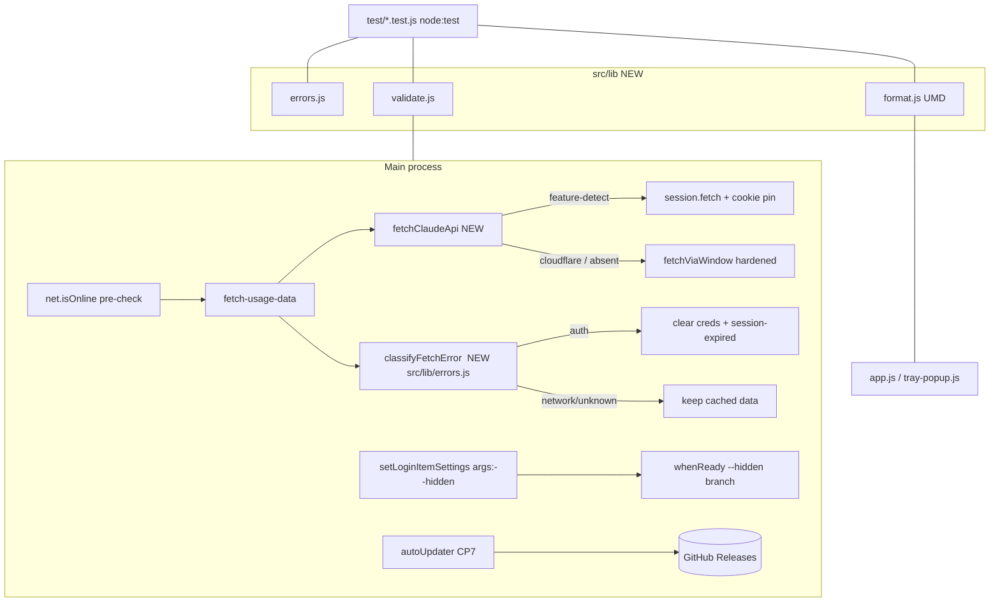

# Plan — Widget Reliability & Standard-Applet Improvements

**Feature:** claude-usage-widget reliability/feature hardening
**Source:** `ARCHITECTURE.md → Known Limitations and Improvement Areas`
**Context:** Prototype-grade personal desktop widget. Windows 11 primary, macOS secondary. Single-process Electron, no framework. Electron `^28.0.0`, Node ≥18 (dev box is Node 20).
**Deployment:** Local install (NSIS/portable on Win, DMG on Mac). No server. CI builds artifacts already.
**Grounding:** Electron official docs (`session`, `net`, `app.setLoginItemSettings`) via Context7; electron-builder Auto-Update docs; council session `claude-usage-widget-review` (Gemini 3.1 Pro + Codex gpt-5.5).

> **Verification reality:** development happens in WSL/Linux. Electron GUI behavior, Windows z-order, tray bounds, auto-update, and OAuth login **cannot be exercised here**. Per-CP verification is therefore: `node --check`, `node:test` unit suites, council code review, and static reasoning. **Windows runtime validation is the user's review gate** after the full plan lands.

---

## User Stories (INVEST) + MoSCoW

| # | As a… | I want… | so that… | MoSCoW |
|---|-------|---------|----------|--------|
| 1 | user on flaky wifi | the widget to keep showing my last usage and quietly retry when the network drops | a transient outage doesn't log me out and wipe the view | **Must** |
| 2 | user on battery | refreshes not to spawn 3 Chromium windows every cycle | my fans/battery aren't hit every few minutes | **Must** |
| 3 | maintainer | the fallback fetch path to settle exactly once | hidden windows can't double-close / leak on races | **Must** |
| 4 | user re-logging in | login not to spawn duplicate windows / leak cookie listeners | auth stays predictable | **Should** |
| 5 | multi-monitor user | the tray popup to anchor correctly when `getBounds()` returns {0,0} | the popup doesn't fly to the wrong screen | **Should** |
| 6 | user with auto-start on | the app to start silently in the tray, not pop the widget open | login isn't interrupted by a window | **Should** |
| 7 | user | the app to update itself from GitHub Releases | I don't manually reinstall | **Could** |
| 8 | maintainer | pure helpers covered by tests | refactors don't silently break formatting/validation | **Could** |

---

## Checkpoints

Batches align to the user's "council review every 2–3 CPs" cadence:
**Batch A = CP1–CP3**, **Batch B = CP4–CP6**, **Batch C = CP7 + CP8a + CP8b**.

### CP1 — Error taxonomy + offline resilience  *(Story 1)* — **Must**
**Files:** `main.js` (`fetch-usage-data`), `src/fetch-via-window.js`, new `src/lib/errors.js`
**Change:**
- Add `src/lib/errors.js` exporting `classifyFetchError(err)` → one of `'auth' | 'cloudflare' | 'network' | 'unknown'`, plus named error-prefix constants. Pure, unit-testable.
  - `cloudflare` ← `CloudflareBlocked` / `CloudflareChallenge` / `UnexpectedHTML` signatures.
  - `network` ← `LoadFailed`, `Request timeout`, DNS/`ERR_*` codes, `net::ERR`, offline.
  - `auth` ← HTTP 401/403 with no cloudflare signature, or explicit `SessionExpired`.
- In `fetch-usage-data`: **`auth` AND `cloudflare` clear credentials + emit `session-expired`** — `cloudflare` is recoverable ONLY by the user opening a visible login window (the hidden fetch window cannot solve a CAPTCHA), so a forced re-login is the correct recovery. **`network`/`unknown` are non-destructive** — throw without clearing creds; renderer keeps cached data. *(Council-corrected: the original "only auth logs out" would silently fail forever on a Cloudflare challenge.)*
  - This preserves today's behavior for cloudflare (already logs out) while fixing the actual bug: a captured DNS/ISP error page (`network`) no longer logs the user out.
- **Response-shape validation:** before returning mandatory usage data, verify it's an object with at least one expected usage field (`five_hour`/`seven_day`). A `{ error: ... }` body returned with HTTP 200 must be classified (auth/cloudflare/unknown), NOT passed through — otherwise the renderer renders a false "No Usage" state (`app.js:657`).
- Add `net.isOnline()` pre-check: short-circuit with a soft "offline" status **only when it returns `false`** (Electron docs: `false` is reliable, `true` is inconclusive — never gate on `true`).
- Preserve: optional endpoint (overage/prepaid) failures remain non-fatal when mandatory usage succeeds.
- `did-fail-load` in `fetch-via-window.js` already yields `LoadFailed: <code> <desc>` → classified as `network`. Keep.
**Verify:** `node:test` for `classifyFetchError` covering each branch + the `{error}`-payload case; `node --check`. Confirm no path calls `deleteSessionKeySecure()` for `network`/`unknown`.
**Risk:** misclassifying a genuine auth failure as network → user stuck on stale data. Mitigation: 401/403 without cf-signature stays `auth`; explicit `SessionExpired` stays `auth`.

### CP2 — Single-settlement guard in `fetch-via-window.js`  *(Story 3)* — **Must**
**Files:** `src/fetch-via-window.js`
**Change:** Add a `settled` flag + `finish(fn)` wrapper so `timeout`, `did-fail-load`, `did-finish-load`, `executeJavaScript` throw, and `loadURL().catch` resolve/reject **once**; guard `win.close()` with `!win.isDestroyed()`. No behavior change on the happy path.
**Verify:** `node --check`; code review of every settle path. (Pure-Electron, not unit-testable without a harness — relies on review + council.)
**Risk:** low. Pure hardening.

### CP3 — Reduce fetch cost: single-window multi-fetch (+ experimental `session.fetch`)  *(Story 2)* — **Must**
*(Council-reframed: a naive `session.fetch` migration would drop `cf_clearance`/`__cf_bm` and fall back to a hidden window on every refresh — defeating the battery goal. The reliable win is collapsing 3 windows → 1.)*
**Files:** `src/fetch-via-window.js` (add multi-URL mode), `main.js` (`fetch-usage-data`)
**Primary change (active path) — one hidden window per refresh, not three:**
- Add `fetchManyViaWindow(urls, opts)`: open **one** hidden window on the Claude partition, navigate to the **mandatory usage URL** (light JSON doc on `claude.ai` origin, clears Cloudflare + sets `cf_clearance` in-context), read its body, then `executeJavaScript` a `Promise.all` of same-origin `fetch()` calls for the optional URLs (overage, prepaid). Same-origin in-page fetch carries the full cookie jar **and** the just-acquired clearance. Returns `{ [url]: result|error }`. Reuses `BLOCKED_SIGNATURES` screening and the CP2 single-settlement guard.
- `fetch-usage-data` calls `fetchManyViaWindow([usageUrl, overageUrl, prepaidUrl])` once; keeps the existing merge logic. Acceptance: **a refresh spawns at most ONE hidden window.**
**Experimental change (default OFF) — zero-renderer path:**
- `fetchClaudeApi(url)` behind `USE_SESSION_FETCH` (env or stored flag, **default false**). Feature-detect `claudeSession.fetch`. When enabled: set the session cookie, build the `Cookie` header from the **full** `claudeSession.cookies.get({url:'https://claude.ai'})` jar (NOT just `sessionKey` — mitigates electron#44456 *and* carries `cf_clearance`); `headers:{ accept:'application/json, text/plain, */*' }`; `redirect:'manual'` (treat any 3xx as fallback, don't trust `response.url`); `await response.text()` once → screen `BLOCKED_SIGNATURES` → `JSON.parse`. On any `cloudflare`/3xx/absent → fall back to the single-window path. Never log the cookie header.
**Verify:** `node --check`; unit-test the URL-allowlist guard + signature screening (extracted pure fn). Runtime auth/perf correctness = **user Windows-validation item**; `session.fetch` stays off until then.
**Risk:** single-window path loads a JSON doc then runs in-page fetch — if Claude's CSP blocks `fetch` from a raw JSON document context, fall back to sequential `fetchViaWindow`. `session.fetch` risks (cookie partition, clearance) are contained by default-off + fallback.

— **Batch A council review here (CP1–CP3).** —

### CP4 — In-flight guard for `detect-session-key`  *(Story 4)* — **Should**
**Files:** `main.js`
**Change:** Module-level `detectSessionKeyInFlight` guard: if a login window is already open, focus it and return instead of opening a second. Ensure cookie listener removal is idempotent (already removed on success + close; make double-call safe).
**Verify:** `node --check`; code review.
**Risk:** low.

### CP5 — Win11 `tray.getBounds()` {0,0} fallback  *(Story 5)* — **Should**
**Files:** `main.js` (`positionAndShowTrayPopup`)
**Change:** When `trayBounds` is {0,0,0} (Win11 quirk), anchor via `screen.getCursorScreenPoint()` + `screen.getDisplayNearestPoint(cursor)` → place popup near cursor at the work-area bottom edge of *that* display, not always primary.
**Verify:** `node --check`; reasoning on multi-monitor coordinate math. Runtime = user validation.
**Risk:** mixed-DPI coordinate mismatch — use display work-area, clamp into bounds.

### CP6 — Silent auto-start (`--hidden`)  *(Story 6)* — **Should**
**Files:** `main.js`
**Change:**
- `setLoginItemSettings` (both call sites) pass `args:['--hidden']` on Windows. `getLoginItemSettings` reads must pass the same args (per docs) if/when used.
- `createMainWindow` gains a `startHidden` option that sets `show:false` in the `BrowserWindow` options (Electron defaults to visible otherwise — council flag). In `whenReady`: if `process.argv.includes('--hidden')`, call `createMainWindow({ startHidden:true })` and **skip** the startup `showInactive`/`startTaskbarWatcher`; tray still created. macOS: also respects `openAsHidden`/dock logic already present.
**Verify:** `node --check`; trace startup branch. Runtime = user validation.
**Risk:** widget never appears if `--hidden` leaks into a normal launch. Mitigation: only auto-start launches inject the arg.

— **Batch B council review here (CP4–CP6).** —

### CP7 — Auto-update via `electron-updater` (inert-by-default)  *(Story 7)* — **Could**
> **Council recommended demoting this to "Won't" for a prototype** (unsigned macOS auto-update fails outright; Windows shows SmartScreen on every background update). User explicitly scoped it, so it's implemented in a **safe, inert form**: present in code, gated by `app.isPackaged` (no-op in dev), never crashes, and CI signing/auto-publish is **not** touched.
**Files:** `package.json` (dep + `build.publish` + mac `zip` target), `main.js` (updater wiring)
**Change:**
- Add `electron-updater` dependency. Add `build.publish = { provider:'github', owner, repo }` (owner/repo from `git remote -v`; if it isn't a clean GitHub remote, leave a clearly-marked `TODO` and skip — **don't guess**).
- Add a `zip` target to the mac build alongside `dmg` (Squirrel.Mac requires zip for auto-update; dmg alone can't update). Safe build-config change.
- In `main.js`, guarded by `if (app.isPackaged)`: lazy-require `electron-updater`, call `autoUpdater.checkForUpdatesAndNotify()` on launch, add a tray "Check for Updates" item, wire `update-downloaded` → notification. **All updater errors are caught and logged — never surfaced as a crash.**
- **Do NOT** modify CI to auto-publish, and do NOT add signing. Document that real updates require a published release + (ideally) signing.
**Verify:** `node --check`; `npm install` resolves the dep; updater code is unreachable in dev (`app.isPackaged===false`). Real update cycle = **user validation**.
**Risk:** unsigned builds → SmartScreen (Win) / silent failure (mac). Documented, out of scope to fix signing.

### CP8a — Unit tests: main-process pure helpers  *(Story 8)* — **Could**
**Files:** new `src/lib/validate.js`, `test/*.test.js`; `package.json` (`"test": "node --test"`); `main.js` consumes `validate.js`.
**Change:** Extract settings validators (`validateBool/Int/Enum`, `sanitizeCSS`) → `src/lib/validate.js` (CommonJS), require from `main.js`. `node:test` suites for these + `classifyFetchError` (CP1's `errors.js`). Wire `npm test`.
**Verify:** `npm test` green; `node --check`; `main.js` validators behave identically (the IPC handler still validates the same way).
**Risk:** low — pure extraction in the main process.

### CP8b — Unit tests: renderer formatters (UMD)  *(Story 8)* — **Could**
**Files:** new `src/lib/format.js` (UMD), `src/renderer/index.html` + `tray-popup.html` (script include), `app.js`/`tray-popup.js` (consume), `test/format.test.js`
**Change:** Extract `formatTime`, `formatResetsAt`, `calculateTrend`, velocity math → `src/lib/format.js`. UMD tail: `if (typeof module !== 'undefined' && module.exports) module.exports = api;` **and** `if (typeof window !== 'undefined') window.ClaudeUsageFormat = api;` — export to a **named global** (council: don't rely on top-level `const` leaking to global). Include `<script src="../lib/format.js">` **before** `app.js`/`tray-popup.js`. `node:test` suite for each fn.
**Verify:** `npm test` green; `node --check`; grep all call sites now read `window.ClaudeUsageFormat.*` (or a local alias); CSP still satisfied (local file, no inline).
**Risk:** renderer script-order / global-name mistakes. Mitigation: named global + grep every call site + verify load order in both HTML files.

— **Batch C council review here (CP7, CP8a, CP8b).** —

---

## Architecture (changes)

## Dependencies
- **New runtime dep:** `electron-updater` (CP7 only).
- **No new dev deps** — tests use built-in `node:test`.
- **External:** GitHub Releases + a release token for CP7 publish (user-side).
- **Code:** CP3 depends on CP1 (taxonomy) + CP2 (hardened fallback). CP8 touches files from CP1 (errors.js) and main.js validators.

## Rollback
Each CP is an isolated commit. CP3 has a runtime kill-switch (fallback-only). CP7 is fully gated by `app.isPackaged`, inert in dev.

## Council review of this plan (session `claude-usage-widget-review`)

**Adopted ✅**
- CP1: `cloudflare` errors must also force re-login (hidden window can't solve CAPTCHA) — fixed the taxonomy. *(Gemini, fatal-flaw catch.)*
- CP1: validate mandatory response shape + classify `{error}`-200 payloads; `net.isOnline()` only gates on `false`. *(Codex.)*
- CP3: reframed from "session.fetch migration" to "single-window multi-fetch (active) + session.fetch (experimental, default-off)"; pin the full cookie jar not just sessionKey; screen body text (CF returns 200s); `redirect:'manual'`. *(Both.)*
- CP6: `createMainWindow({startHidden})` must set `show:false`. *(Codex.)*
- CP8 split into 8a (main) / 8b (renderer); UMD exports to a named global with `typeof module` guard. *(Codex + Gemini.)*

**Noted but overridden ⚖️**
- CP7 → both recommended "Won't" for a prototype. User explicitly scoped it → kept, but inert-by-default (`app.isPackaged`-gated, errors swallowed), + mac `zip` target, no CI signing/publish changes. Flagged to user.

**Disagreements:** none material — the two models reinforced each other (Gemini led on CF/re-login, Codex on response-shape + cookie-jar detail).

## Out of scope (documented, not done)
- Code signing (Win/Mac) — pre-existing gap; auto-update works unsigned with SmartScreen warnings.
- Replacing the persistent-widget interaction model.
- Bundler/module system for the renderer (UMD shim avoids it).
