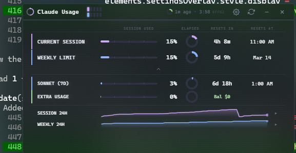
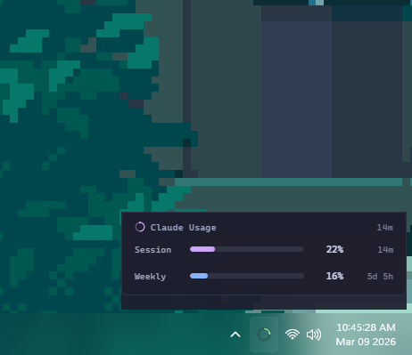
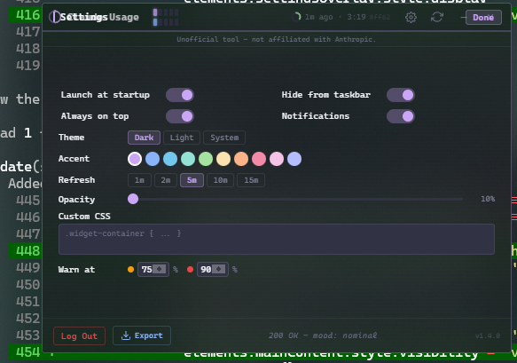

# Claude Usage Widget

A desktop widget for Windows (and macOS) that shows your Claude.ai usage in real-time. Sits in the corner of your screen, always on top.



---

## Quickstart (5 minutes)

### Prerequisites

- [Node.js 18+](https://nodejs.org) (includes npm)
- A [Claude.ai](https://claude.ai) account with an active subscription

### Setup

```bash
git clone https://github.com/RyHops/claude-usage-widget.git
cd claude-usage-widget
npm install
npm start
```

### Login

1. The widget opens with a login prompt
2. Click **"Login to Claude"** — a browser window opens
3. Sign in to your Claude.ai account as usual
4. The window closes automatically once authenticated
5. Usage data appears immediately

That's it. The widget is now running.

---

## What You See

### Main Widget

| Element | What it shows |
|---------|--------------|
| **Session** bar (purple) | Current 5-hour usage window (0–100%) |
| **Weekly** bar (blue) | Rolling 7-day usage window (0–100%) |
| **Timers** | Countdown to next reset + clock time |
| **History charts** | 24-hour sparklines with Y-axis and threshold lines |

**Color coding:** Purple = normal, Orange = warning (75%+), Red = danger (90%+). Thresholds are configurable.

### Tray Popup

Hover over the system tray icon to see a quick usage summary with a rotating cast of quirky sayings — sci-fi quotes, dev humor, and AI quips in Claude orange.



### Settings

Click the gear icon (or right-click title bar) to access settings.



- **Launch at startup** — auto-start with Windows/macOS login
- **Always on top** — keep widget visible across all windows
- **Hide from taskbar** — tray-only mode
- **Theme** — Dark / Light / System
- **Accent color** — choose your vibe
- **Warning/danger thresholds** — customize when bars turn orange/red
- **Opacity** — make the widget semi-transparent
- **Custom CSS** — inject your own styles
- **Export** — download usage history as CSV

---

## Controls

| Action | How |
|--------|-----|
| **Move** | Drag the title bar |
| **Refresh** | Click the refresh icon |
| **Settings** | Click the gear icon |
| **Minimize** | Click `−` (hides to system tray) |
| **Close** | Click `×` (hides to tray — doesn't quit) |
| **Expand** | Click `▼` to show extra usage details |
| **Quit** | Right-click tray icon → Exit |

The widget snaps to screen edges and reacts to the Windows auto-hide taskbar.

---

## Build from Source

```bash
# Windows installer + portable
npm run build:win

# macOS DMG (must run on a Mac)
npm run build:mac
```

Output goes to `dist/`.

---

## Troubleshooting

**"Login Required" keeps appearing**
- Session expired. Click "Login to Claude" to re-authenticate.

**Widget not updating**
- Click refresh manually. Check internet. Try re-logging via tray menu.

**Build errors**
```bash
rm -rf node_modules package-lock.json
npm install
```

**Debug mode**
```bash
# Flag
electron . --debug

# Environment variable
DEBUG_LOG=1 npm start
```

---

## Privacy

- Credentials stored **locally only** (encrypted via electron-store)
- No third-party servers — only communicates with `claude.ai`
- Logout clears all stored credentials, cookies, and session data

---

## Tech Stack

- Electron 28 + pure JavaScript (no framework)
- electron-store for encrypted local storage
- Programmatic PNG/ICO generation (no image dependencies)

---

## License

MIT

---

## Disclaimer

Unofficial tool — not affiliated with or endorsed by Anthropic.
